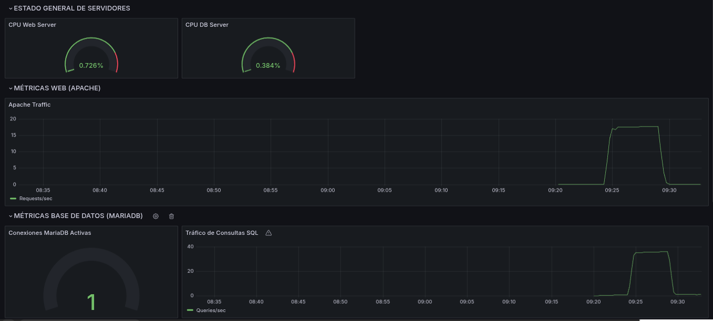

# 🛡️ Proyecto SENTINEL — Tienda Segura (Psicopompo)

**SENTINEL** es una infraestructura cloud de nivel empresarial diseñada para alojar la aplicación e-commerce **Psicopompo**. Este TFG (Trabajo de Fin de Grado) se centra en la creación de un entorno búnker que combina alta disponibilidad, monitorización en tiempo real y respuesta activa ante amenazas.

---

## 🏗️ Arquitectura del Sistema (Multi-Tier)
La infraestructura está diseñada bajo el principio de **Defensa en Profundidad**, segmentando la red en AWS para aislar la lógica de negocio y los datos sensibles del acceso directo desde Internet.

| Capa | Componente | Descripción |
| :--- | :--- | :--- |
| **Perímetro** | AWS ALB | Balanceo de carga L7 y terminación SSL/TLS (Let's Encrypt). |
| **Aplicación** | Apache / PHP 8 | Servidores web en subredes privadas sin IP pública. |
| **Datos** | Amazon RDS MariaDB | Base de datos Multi-AZ con cifrado y backups automáticos. |
| **Seguridad** | Wazuh SIEM | Detección de intrusiones (HIDS) y respuesta activa. |
| **Observabilidad** | Stack WPG | Grafana, Prometheus y Loki para métricas y logs. |

---

## 🛡️ Pilares de Seguridad
*   **Búnker Networking:** Control estricto de tráfico saliente mediante un **Proxy Squid** y Security Groups altamente granulares.
*   **Respuesta Activa:** Integración de Wazuh para el bloqueo dinámico de ataques de fuerza bruta (MITRE ATT&CK Mapping).
*   **Gestión de Secretos:** Aislamiento total de credenciales y llaves `.pem` de la infraestructura.
*   **Cifrado Total:** HTTPS forzado en todo el flujo mediante redirección 301 en el balanceador.

---

## 📊 Observabilidad y Rendimiento
El sistema no solo es seguro, sino que es **visible**. Monitorizamos cada petición y cada proceso para garantizar la estabilidad del negocio.

### Métricas Clave Validadas:
- **Rendimiento Máximo:** 59.01 peticiones por segundo (RPS).
- **Latencia p90:** < 384 ms en condiciones de carga.
- **Resiliencia:** RTO (Tiempo de recuperación) < 15 minutos mediante backups automáticos en **AWS S3**.

---

## 📁 Estructura del Repositorio
*   [`/app`](app): Código fuente de la tienda Psicopompo (PHP/MySQL).
*   [`/infrastructure`](infrastructure): Scripts de automatización, configuraciones de monitoreo y base de datos.
*   [`/docs`](docs): Documentación completa del proyecto (Memorias, Manuales, Informes ASIR).
*   [`/PROJECT_CONTROL`](PROJECT_CONTROL): Archivos de gestión estratégica (Estado, Decisiones, Workflows).
*   [`/secrets`](secrets): (Ignorado en Git) Almacén de llaves `.pem` y credenciales sensibles.

---

## 🛠️ Tecnologías Utilizadas
*   **Infraestructura:** AWS (VPC, EC2, RDS, S3, ALB).
*   **SO & Servicios:** Amazon Linux 2023, Ubuntu, Apache, MariaDB, PHP 8.2.
*   **Seguridad:** Wazuh SIEM, Fail2Ban, Netfilter/Iptables.
*   **Monitorización:** Prometheus, Grafana, Loki, Node Exporter.
*   **Herramientas:** Terraform (Roadmap), Docker, Bash Scripting.

---
**Desarrollado con ❤️ por Alex Vidal Ródenas para el Grado Superior de ASIR.**  
*Este proyecto es el resultado de la integración de competencias en redes, sistemas, seguridad y desarrollo web.*
