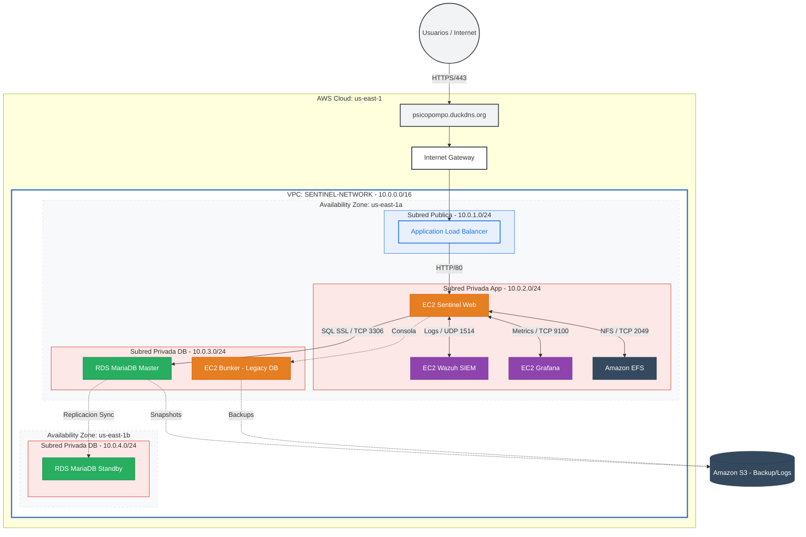

```mermaid
flowchart TD
    %% ==========================================
    %% ESTILOS GLOBALES
    %% ==========================================
    classDef internet fill:#f1f3f4,stroke:#3c4043,color:#3c4043,stroke-width:2px;
    classDef aws_region fill:#ffffff,stroke:#232f3e,stroke-width:2px;
    classDef vpc fill:#ffffff,stroke:#3b71ca,color:#3b71ca,stroke-width:3px;
    classDef az fill:#f8f9fa,stroke:#dee2e6,stroke-width:1px,stroke-dasharray: 5 5;
    classDef public fill:#e8f0fe,stroke:#1a73e8,color:#1a73e8,stroke-width:2px;
    classDef private fill:#fce8e6,stroke:#d93025,color:#d93025,stroke-width:2px;
    
    classDef compute fill:#e67e22,color:#fff,stroke:#d35400;
    classDef database fill:#27ae60,color:#fff,stroke:#1e8449;
    classDef monitor fill:#8e44ad,color:#fff,stroke:#7d3c98;
    classDef storage fill:#34495e,color:#fff,stroke:#2c3e50;

    %% ==========================================
    %% ESTRUCTURA EXTERNA
    %% ==========================================
    User((Usuarios / Internet)):::internet
    DNS[psicopompo.duckdns.org]:::internet
    S3[(Amazon S3 - Backup/Logs)]:::storage

    User -->|HTTPS/443| DNS

    subgraph AWS [AWS Cloud: us-east-1]
        direction TB
        IGW[Internet Gateway]:::aws_region
        DNS --> IGW

        subgraph VPC_SENTINEL [VPC: SENTINEL-NETWORK - 10.0.0.0/16]
            direction TB
            
            subgraph AZ_A [Availability Zone: us-east-1a]
                direction TB
                
                subgraph Public_Subnet [Subred Publica - 10.0.1.0/24]
                    ALB[Application Load Balancer]:::public
                end

                subgraph App_Subnet [Subred Privada App - 10.0.2.0/24]
                    Web[EC2 Sentinel Web]:::compute
                    Wazuh[EC2 Wazuh SIEM]:::monitor
                    Grafana[EC2 Grafana]:::monitor
                    EFS[Amazon EFS]:::storage
                end

                subgraph DB_Subnet_A [Subred Privada DB - 10.0.3.0/24]
                    RDS_M[RDS MariaDB Master]:::database
                    Bunker[EC2 Bunker - Legacy DB]:::compute
                end
            end

            subgraph AZ_B [Availability Zone: us-east-1b]
                subgraph DB_Subnet_B [Subred Privada DB - 10.0.4.0/24]
                    RDS_S[RDS MariaDB Standby]:::database
                end
            end
        end
    end

    %% ==========================================
    %% CONEXIONES Y FLUJOS
    %% ==========================================
    IGW --> ALB
    ALB -->|HTTP/80| Web

    Web <-->|Logs / UDP 1514| Wazuh
    Web <-->|Metrics / TCP 9100| Grafana
    Web <-->|NFS / TCP 2049| EFS

    Web -->|SQL SSL / TCP 3306| RDS_M
    Web -.->|Consola| Bunker
    
    RDS_M -.->|Replicacion Sync| RDS_S
    Bunker -.->|Backups| S3
    RDS_M -.->|Snapshots| S3

    %% Asignación de Clases a Subgrafos
    style VPC_SENTINEL fill:#ffffff,stroke:#3b71ca,stroke-width:3px;
    style AZ_A fill:#f8f9fa,stroke:#dee2e6,stroke-dasharray: 5 5;
    style AZ_B fill:#f8f9fa,stroke:#dee2e6,stroke-dasharray: 5 5;
    style Public_Subnet fill:#e8f0fe,stroke:#1a73e8;
    style App_Subnet fill:#fce8e6,stroke:#d93025;
    style DB_Subnet_A fill:#fce8e6,stroke:#d93025;
    style DB_Subnet_B fill:#fce8e6,stroke:#d93025;
```
