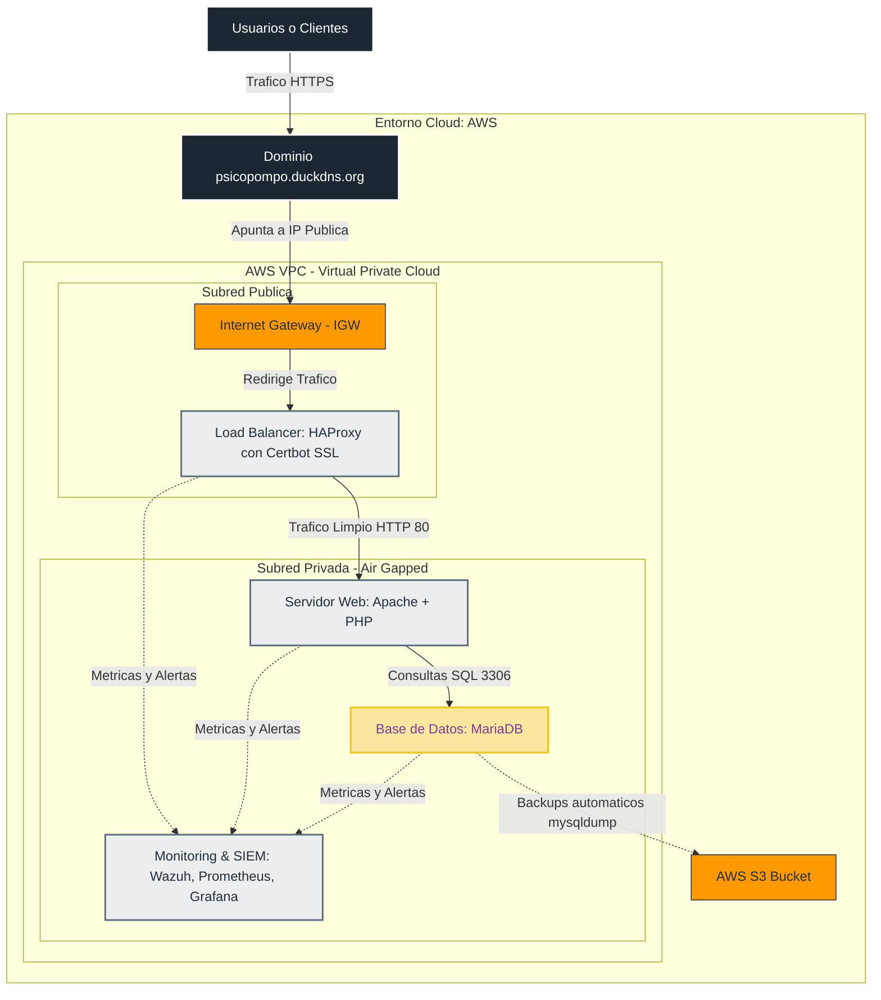

```mermaid
graph TD
    classDef internet fill:#1d2633,stroke:#ffffff,color:#ffffff,stroke-width:2px;
    classDef aws fill:#ff9900,stroke:#232f3e,color:#232f3e,stroke-width:1px;
    classDef subredPub fill:#d4efdf,stroke:#229954,color:#145a32,stroke-width:2px,stroke-dasharray: 5 5;
    classDef subredPriv fill:#fadbd8,stroke:#cb4335,color:#7b241c,stroke-width:2px,stroke-dasharray: 5 5;
    classDef instancia fill:#ebedef,stroke:#5d6d7e,color:#212f3d,stroke-width:2px;
    classDef db fill:#f9e79f,stroke:#f1c40f,color:#7d3c98,stroke-width:2px;

    Users["Usuarios o Clientes"]:::internet
    DNS["Dominio psicopompo.duckdns.org"]:::internet

    Users -->|Trafico HTTPS| DNS

    subgraph AWS ["Entorno Cloud: AWS"]
        IGW["Internet Gateway - IGW"]:::aws
        DNS -->|Apunta a IP Publica| IGW

        subgraph VPC ["AWS VPC - Virtual Private Cloud"]
            
            subgraph Public ["Subred Publica"]
                HAProxy["Load Balancer: HAProxy con Certbot SSL"]:::instancia
                IGW -->|Redirige Trafico| HAProxy
            end

            subgraph Private ["Subred Privada - Air Gapped"]
                WebServer["Servidor Web: Apache + PHP"]:::instancia
                DBServer["Base de Datos: MariaDB"]:::db
                Monitoring["Monitoring & SIEM: Wazuh, Prometheus, Grafana"]:::instancia
            end

            HAProxy -->|Trafico Limpio HTTP 80| WebServer
            WebServer -->|Consultas SQL 3306| DBServer

            HAProxy -.->|Metricas y Alertas| Monitoring
            WebServer -.->|Metricas y Alertas| Monitoring
            DBServer -.->|Metricas y Alertas| Monitoring
        end

        S3["AWS S3 Bucket"]:::aws
        DBServer -.->|Backups automaticos mysqldump| S3
    end
```
